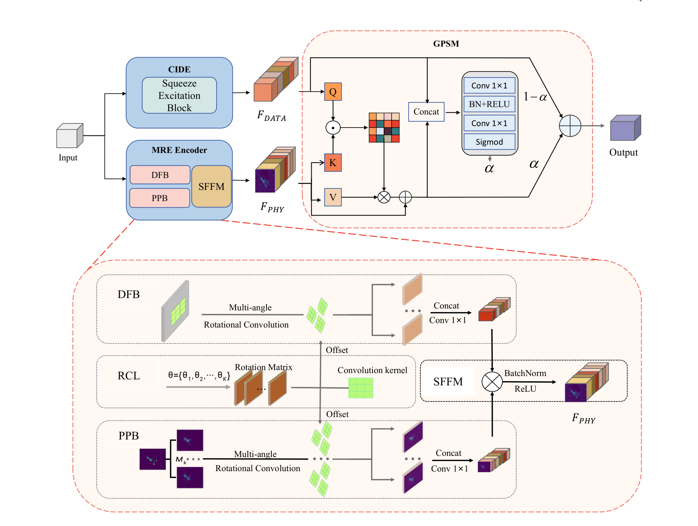

# PGRA: Physics Guided Rotation Adaptive Attention for Few-Shot SAR Target Recognition

## 1. Introduction

Official implementation of the paper **"PGRA: Physics Guided Rotation Adaptive Attention for Few-Shot SAR Target Recognition"**, *IEEE Transactions on Antennas and Propagation*, 2026.

```bibtex
@article{hu2026pgra,
  title   = {PGRA: Physics Guided Rotation Adaptive Attention for Few-Shot SAR Target Recognition},
  author  = {Hu, Binze and Xiao, Xiayang and Zhang, Xu and Wang, Haipeng},
  journal = {IEEE Transactions on Antennas and Propagation},
  year    = {2026},
  doi     = {10.1109/TAP.2026.3684830}
}
```



## 2. Features

A drop-in attention block for few-shot SAR target recognition, plugged into a **DenseNet121** backbone. It has three components:

* **CIDE** — channel attention on data features.
* **MRE-Encoder** — parallel rotation-equivariant branches on image and ASC features, fused by SFFM.
* **GPSM** — cross-attention between physics and data features with a spatial gate.

## 3. Contributions

* A physics-guided rotation-adaptive attention that couples rotation-equivariant convolutions with ASC priors.
* Backbone-friendly; consistently improves accuracy under the OFA protocol.
* Full training and evaluation pipeline released.

## 4. Getting Started

### 4.1 Environment

```bash
pip install -r requirements.txt
```

Build the DCNv2 CUDA kernel once:

```bash
git clone -b pytorch_1.0.0 https://github.com/chengdazhi/Deformable-Convolution-V2-PyTorch.git
cd Deformable-Convolution-V2-PyTorch && sh make.sh
```

### 4.2 Data

MSTAR with ASC decomposition and the OFA protocol from [PIHA](https://github.com/XAI4SAR/PIHA) ([Google Drive](https://drive.google.com/file/d/1OqdgOodVVAJclnjSH06B4tvVn9F1C4Ns/view?usp=sharing)).


The index files (`data/*/list/*.txt`) are shipped with this repository; only the `.npz` payload needs to be downloaded and placed under the matching `data/*/img/` directories referenced by the lists:

```
data/
├── Train/{img/*.npz, list/train_{10,15,20,25}.txt, list/val_{10,15,20,25}.txt}
├── OFA1_2/{img/*.npz, list/OFA1.txt, list/OFA2.txt}
└── OFA3/{img/*.npz, list/OFA3.txt}
```

### 4.3 Training

```bash
python tools/train.py \
    --train_list data/Train/list/train_10.txt \
    --val_list data/Train/list/val_10.txt \
    --ofa1_list data/OFA1_2/list/OFA1.txt \
    --ofa2_list data/OFA1_2/list/OFA2.txt \
    --ofa3_list data/OFA3/list/OFA3.txt \
    --attention_setting \
    --save_path runs/densenet_pgra_10/
```

Omit `--attention_setting` to train the plain baseline. One-line launcher (trains 5 runs, then auto-aggregates results into `summary.txt`):

```bash
bash scripts/train_densenet.sh 10
```

### 4.4 Evaluation

Aggregate per-run results (also written to `<path>/result.txt`):

```bash
python tools/evaluate.py --path runs/densenet_pgra_10/
```

Re-evaluate a checkpoint on OFA:

```bash
python tools/eval_ofa.py \
    --ckpt runs/densenet_pgra_10/0.pth \
    --attention_setting \
    --ofa1_list data/OFA1_2/list/OFA1.txt \
    --ofa2_list data/OFA1_2/list/OFA2.txt \
    --ofa3_list data/OFA3/list/OFA3.txt
```

## 5. Acknowledgements

* DenseNet primitives from [`torchvision.models.densenet`](https://github.com/pytorch/vision).
* `pgra/ops/` from [chengdazhi/Deformable-Convolution-V2-PyTorch](https://github.com/chengdazhi/Deformable-Convolution-V2-PyTorch/tree/pytorch_1.0.0).
* ASC data, OFA protocol, and dataset schema from [PIHA](https://github.com/XAI4SAR/PIHA).

See [`NOTICE`](NOTICE) for full attribution.

## License

Apache-2.0 — see [`LICENSE`](LICENSE).
